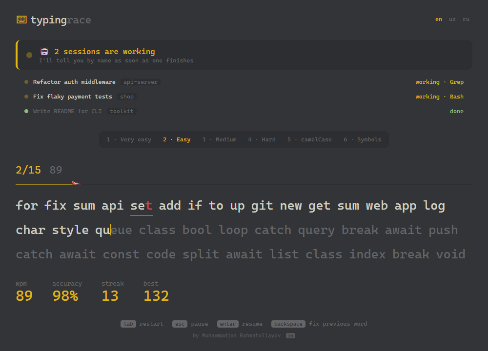
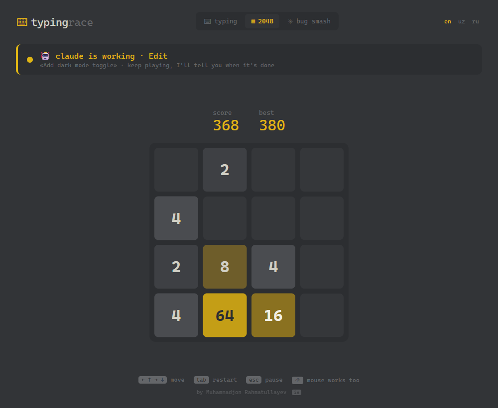
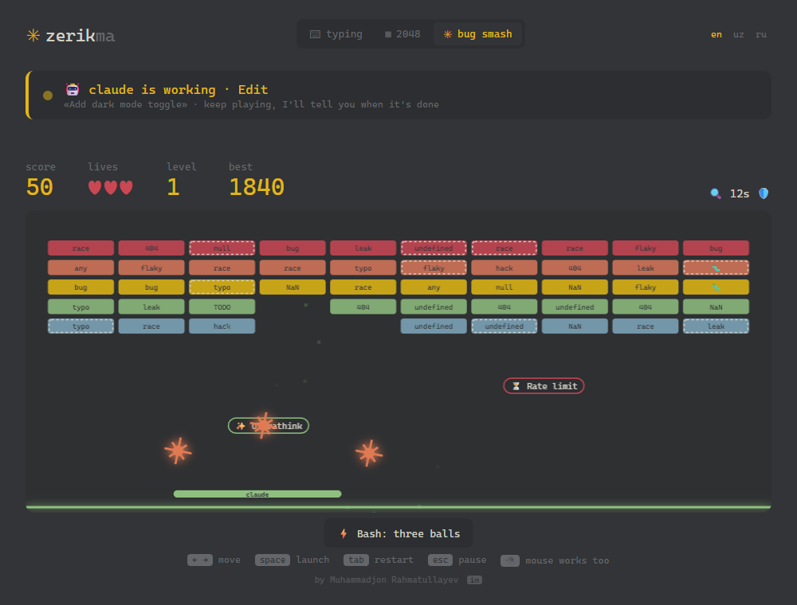
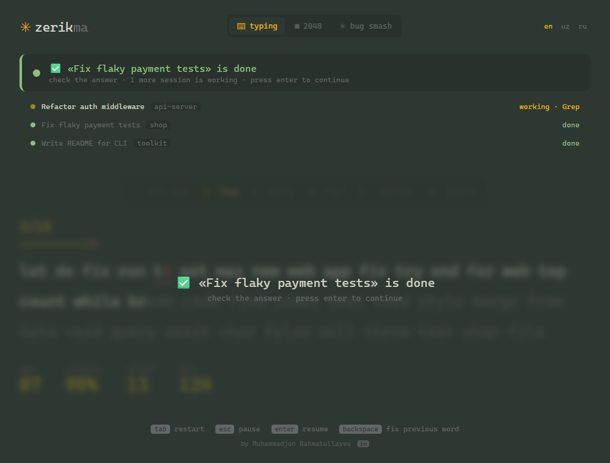

# Zerikma for Claude Code

> *Zerikma* means **"don't get bored"** in Uzbek.

**Stop staring at the spinner.** Three calm mini-games open next to Claude Code while it works, and they tell you the moment a session is done.



## 📰 News: learn Claude Code while you wait

The first tab is a feed of short Claude Code tips in your language (English, O'zbekcha, Русский): `/compact`, plan mode, hooks, skills, subagents, MCP and more, each with the exact command and a link to the official docs. When Claude is using a tool, the tab suggests a related tip (for example, `/permissions` while Claude runs `Bash`). New tips are written from the official Claude Code changelog and reviewed before they ship.

## Three games

### ⌨ Typing Race
A Monkeytype-style typing test that starts easy and climbs through 6 levels: `if for let` → `class async` → `return promise` → `constructor` → `useEffect TryGetValue` → `x?.y??z`. Typed words stay on screen, and `Backspace` on an empty word jumps back to fix the previous mistake.

### ▦ 2048
The classic, in soft serika colors. Tiles slide smoothly and pop when they merge. Play with the arrow keys, WASD, or by dragging with the mouse.



### ✳ Bug Smash
Breakout, but the bricks are bugs: `null`, `TODO`, `flaky`, `NaN`, `undefined`… Your paddle is **claude** and the ball is a spinning spark. Dashed "legacy" bricks take two hits, and 🐛 bricks always drop a bonus. The bonuses are Claude Code tools:

| Bonus | Effect |
|---|---|
| 🔍 **Grep** | wider paddle |
| ⚡ **Bash** | splits into three balls |
| 📄 **Read** | slower ball |
| 🛡️ **Plan** | one-time safety net |
| ✨ **Ultrathink** | the ball smashes straight through bricks |
| ❤️ **+1** | extra life |
| ⏳ **Rate limit** | *careful:* smaller paddle |

Move with `←` `→` or the mouse, and launch with `space` or a click.



## Claude-aware

- **Works right away.** It follows Claude Code's own session files, so there's nothing to install or configure.
- **Tracks every session.** Run four Claude sessions at once and each one is listed by its title. When one finishes, you'll see *"«Fix flaky payment tests» is done"*, even while the others keep working.
- **Hard to miss.** When Claude finishes, the whole background shifts to a soft green and the game pauses. When Claude needs your permission, it turns warm amber.
- **Easy on the eyes.** The low-contrast "serika dark" palette has no pure white or pure black.
- **English, O'zbekcha, Русский.** Pick your language right in the game.



## How to use

1. Install the extension.
2. Ask Claude Code something. The games open beside the Claude panel without taking focus.
3. Pick a game from the tabs at the top and start playing.

You can also open them at any time from the **Zerikma** button in the status bar or with **Zerikma: Open games** in the command palette.

In every game, `tab` restarts, `esc` pauses and `enter` resumes. Bug Smash pauses automatically when you click away.

## Work first, then play

Zerikma is for the waiting time, not instead of your work:

1. **Claude finishes:** you get **10 seconds** to finish your round.
2. **Then the game locks.** `Enter` no longer resumes it, and a timer shows how long Claude has been waiting: *"🔒 claude is waiting for you · 1:24"*. After a minute the panel turns amber. In VS Code, the cursor jumps to the Claude input box.
3. **Reply to Claude:** the game unlocks by itself as soon as Claude starts working again.
4. **Reply within 30 seconds** and you get a **⚡ quick reply** bonus and a streak.

Need a real break? `Shift+Enter` (`ctrl+t` in the terminal) gives you **2 more minutes, once an hour**. If you'd rather have the game only pause, turn off `typingRace.strictMode` (or run `zerikma --gentle`).

## Working in the terminal? `/zerikma`

Zerikma also runs in the terminal, with the same three games and the same "Claude is done" alerts.

**Inside Claude Code**, install the plugin once:

```
/plugin marketplace add IRMuhammadjon/typing-race-for-claude-code
/plugin install zerikma@zerikma
```

After that, type **`/zerikma`** in any session. The games open in a tmux split, a Windows Terminal pane or a new window, or as this panel if Claude runs inside VS Code. `/zerikma 2048` and `/zerikma bug` start a specific game.

**Or run it yourself** in a second terminal: `npx zerikma` ([details](cli/README.md)).

## Optional: permission alerts

Claude Code doesn't record in its session files when it's waiting for your permission. To get an amber **"Claude needs your permission"** alert as well, run **Zerikma: Install Claude Code hooks** once. This adds a small hook to `~/.claude/settings.json` and keeps a backup as `settings.json.bak-typing-race`. You can remove it any time with **Zerikma: Remove Claude Code hooks**.

## Settings

| Setting | Default | Description |
|---|---|---|
| `typingRace.autoOpen` | `true` | Open the game automatically when Claude starts working |
| `typingRace.strictMode` | `true` | Lock the game after Claude finishes until you reply |
| `typingRace.focusClaude` | `true` | Move the cursor to the Claude input box when the game locks |
| `typingRace.newsOnline` | `true` | Check GitHub for new tips (at most every 6 hours) |

## Privacy

Everything stays on your machine. The extension:

- reads only the **last few KB** of Claude Code session files in `~/.claude/projects`, to see whether a session is working or done and what its title is;
- sends nothing about you anywhere: no telemetry, no analytics, no accounts;
- stores only your best scores, chosen language and which tips you've read in VS Code's local storage;
- downloads the public tips file from GitHub (`raw.githubusercontent.com`) at most every 6 hours. No data about you is sent. Turn this off with `typingRace.newsOnline` (or `zerikma --offline`) to use only the tips bundled with the extension.

## Disclaimer

This is an independent community project. It is **not affiliated with, endorsed by, or sponsored by Anthropic**. "Claude" and "Claude Code" are trademarks of Anthropic, PBC.

## Author

Made by **Muhammadjon Rahmatullayev** · [LinkedIn](https://www.linkedin.com/in/muhammadjon-rahmatullayev-b9356a321/)

Found a bug or have an idea? [Open an issue](https://github.com/IRMuhammadjon/typing-race-for-claude-code/issues).

Licensed under the [MIT License](LICENSE).
