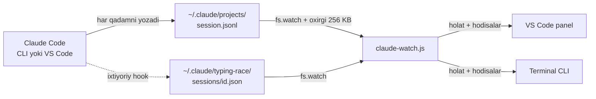

# Zerikma: Claude Code sessiyalari bilan qanday ishlaydi

2026-yil 25-sentabr · Muhammadjon Rahmatullayev

## Qisqacha

Zerikma Claude Code bilan hech qanday API, socket yoki extension orqali gaplashmaydi. Claude Code har bir sessiyani diskka **JSONL transcript** qilib yozib boradi, Zerikma esa shu fayllarning oxirini kuzatib, sessiya ishlayaptimi yoki tugadimi, shuni aniqlaydi. Hech narsa o'rnatish shart emas. Faqat "ruxsat so'rayapti" holati transcriptda ko'rinmaydi, u uchun ixtiyoriy Claude Code **hook**'lari ishlatiladi.



Umumiy modul `shared/claude-watch.js` sessiyalar ro'yxatini, har birining holatini (`busy` / `idle` / `waiting`) va "tugadi" hodisalarini beradi. VS Code extension ham, terminal versiyasi ham aynan shu moduldan foydalanadi.

## Ma'lumot manbalari

### 1. Transcript fayllari (asosiy manba)

Claude Code har bir sessiyani `~/.claude/projects/<loyiha>/<session_id>.jsonl` fayliga yozadi. `<loyiha>` papka nomi ishchi papkadan yasaladi (masalan `d--leetcode`), fayl nomi esa sessiya ID'si. Har bir qator bitta JSON yozuv, yangilari fayl oxiriga qo'shiladi. Bu format rasmiy hujjatlashtirilmagan: quyidagi maydonlar haqiqiy fayllarni o'qib aniqlandi.

| `type` | Qachon yoziladi | Bizga nima beradi |
| --- | --- | --- |
| `user` (matn) | Foydalanuvchi savol yubordi | Claude ish boshladi |
| `assistant` + `tool_use` | Claude tool chaqirdi | ishlayapti, tool nomi (`Grep`, `Bash`...) |
| `user` + `tool_result` | Tool natijasi qaytdi | ishlash davom etyapti |
| `assistant`, `stop_reason: "end_turn"` | Javob tugadi | Claude tugatdi |
| `ai-title` / `custom-title` | Sessiya nomlandi | Claude panelidagi tab sarlavhasi |
| `last-prompt` | Oxirgi savol | nom bo'lmasa, sarlavha o'rniga |

Har bir yozuvda `cwd` (loyiha nomi uchun), `isSidechain` (subagent yozuvi) va `isMeta` (xizmat yozuvi) maydonlari ham bor. Qisqartirilgan misol:

```json
{"type":"user","message":{"role":"user","content":"leetcode testlarini ishga tushir"},"cwd":"D:\\leetcode"}
{"type":"assistant","message":{"content":[{"type":"tool_use","name":"Bash"}],"stop_reason":"tool_use"}}
{"type":"user","message":{"content":[{"type":"tool_result"}]}}
{"type":"assistant","message":{"content":[{"type":"text"}],"stop_reason":"end_turn"}}
{"type":"ai-title","aiTitle":"Claude extension mini-game during search"}
```

### 2. Hook'lar (ixtiyoriy)

Transcriptda Claude ruxsat kutayotgani ko'rinmaydi. Buni bilish uchun extension buyrug'i `~/.claude/settings.json` fayliga hook qo'shadi va eski faylni `settings.json.bak-typing-race` nomi bilan saqlab qo'yadi. Hook voqealari: `UserPromptSubmit`, `PreToolUse`, `PostToolUse`, `Notification`, `Stop`, `SessionEnd`.

Hook skripti (`hooks/typing-race-hook.js`) stdin'dan JSON oladi va `~/.claude/typing-race/sessions/<session_id>.json` fayliga `{status, tool, ts}` yozadi. `Notification` voqeasida xabar ruxsat haqida bo'lsa, holat `waiting` bo'ladi. Skript ikkita qoidaga amal qiladi:

- **stdout'ga hech narsa chiqarmaydi**, chunki `UserPromptSubmit` hook'ining stdout'i Claude kontekstiga qo'shiladi;
- **har doim 0 kodi bilan chiqadi**, xato bo'lsa ham Claude ishini to'xtatmaydi.

## Holatni aniqlash

Sessiya holati transcriptning **oxirgi muhim yozuvi**ga qarab aniqlanadi. Fayl bir necha MB bo'lishi mumkin, shuning uchun faqat oxirgi **256 KB** o'qiladi (`fs.readSync` bilan, fayl oxiridan). Keyin qatorlar oxiridan boshiga qarab ko'rib chiqiladi.

1. JSON bo'lmagan qator o'tkazib yuboriladi: 256 KB chegarasida birinchi qator kesilgan bo'ladi.
2. `isSidechain` (subagent) va `isMeta` yozuvlari hamda `message`'i yo'q yozuvlar (`ai-title`, `mode`...) o'tkazib yuboriladi.
3. Birinchi mos kelgan yozuv bo'yicha qaror qilinadi:

| Oxirgi muhim yozuv | Holat |
| --- | --- |
| `assistant`, `stop_reason` = `end_turn` yoki `stop_sequence` | `idle` (tugadi) |
| `assistant` + `tool_use` | `busy`, tool nomi bilan |
| `user` + `tool_result` | `busy`: tool nomini topish uchun bitta oldingi `assistant` yozuviga qaraladi |
| `user`, matni `[Request interrupted` bilan boshlanadi | `idle` (foydalanuvchi to'xtatdi) |
| `user`, matnida `<local-command-stdout>` bor | `idle` (`/clear` kabi lokal buyruq) |
| boshqa `user` matni | `busy` (yangi savol) |
| hech narsa topilmadi | `busy`: fayl o'zgargan, lekin oxirida juda katta tool natijasi turibdi |

Sessiya nomi ham shu 256 KB ichidan olinadi. Ustuvorlik tartibi: `custom-title`, keyin `ai-title` (Claude panelidagi tab sarlavhasi bilan bir xil), keyin `last-prompt`. Loyiha nomi oxirgi `cwd` maydonining papka nomidan olinadi.

Kod: `transcriptStatus()` va `transcriptInfo()`, [shared/claude-watch.js](https://github.com/IRMuhammadjon/typing-race-for-claude-code/blob/main/shared/claude-watch.js).

## Kuzatish mexanizmi

`createWatcher({ onUpdate, onFinished, onWaiting })` fayllarni kuzatadi va o'zgarishlarni uchta callback orqali beradi.

- **Fayl kuzatuvi:** `fs.watch(~/.claude/projects, { recursive: true })`. Faqat 2 darajali yo'llar (`<loyiha>/<sessiya>.jsonl`) olinadi, shu bilan `<sessiya>/subagents/*.jsonl` o'tkazib yuboriladi. Har bir fayl uchun **100 ms debounce** bor: Claude bir javobda bir nechta qator yozadi.
- **Polling zaxirasi:** recursive `fs.watch` bo'lmagan joylarda (eski Node bilan Linux) har **1.5 s**da papkalar skanerlanadi va faqat `mtime`'i o'zgargan fayllar qayta o'qiladi.
- **Ishga tushishda:** oxirgi 15 daqiqada o'zgargan transcriptlar o'qiladi, shu bilan allaqachon ishlayotgan sessiyalar ham ko'rinadi.
- **Eskirish:** 15 daqiqa o'zgarmagan sessiya ro'yxatdan chiqariladi (tashlab ketilgan yoki yopilgan). Buni har 30 s tekshiriladi.
- **Birlashtirish:** hook fayli va transcript bir sessiya ID'si bo'yicha birlashtiriladi. `ts` qaysi birida yangiroq bo'lsa, holat o'shandan olinadi. Masalan, `PreToolUse` dan keyin `Notification` kelsa, `waiting` ustun bo'ladi.

### Har bir sessiya uchun hodisalar

Umumiy holat bitta bayroq emas. Har bir sessiyaning oldingi holati eslab qolinadi, o'tishlar alohida hodisa bo'ladi:

| O'tish | Hodisa | Nima uchun kerak |
| --- | --- | --- |
| `busy` → `idle` | `onFinished(session)` | 4 ta sessiyadan bittasi tugasa, qolganlari ishlab tursa ham xabar beriladi |
| har qanday → `waiting` | `onWaiting(session)` | ruxsat so'ralganda (faqat hook'lar bilan) |
| ro'yxat yoki holat o'zgardi | `onUpdate({status, tool, sessions})` | panel, sessiyalar ro'yxati, status bar |

Birinchi ko'rilgan sessiya uchun hodisa chiqmaydi. Aks holda extension ochilishi bilan eski tugagan sessiyalar haqida xabar berib yuborardi. `onUpdate` faqat JSON ko'rinishi oldingisidan farq qilganda chaqiriladi.

## Claude bilan boshqa bog'lanish nuqtalari

### Claude qayerda ishlayotganini aniqlash

Claude Code o'zi ishga tushirgan jarayonlarga muhit o'zgaruvchilarini beradi. Eng foydalisi `CLAUDE_CODE_ENTRYPOINT`: VS Code panelida u `claude-vscode` bo'ladi. `zerikma open` shunga qarab o'yinni to'g'ri joyda ochadi:

| Belgi | Qayerda ochiladi |
| --- | --- |
| `CLAUDE_CODE_ENTRYPOINT=claude-vscode` | VS Code paneli, `vscode://MuhammadjonRahmatullayev.typing-race-for-claude-code/open` orqali |
| `TMUX` | `tmux split-window`, Claude paneli `TMUX_PANE` sifatida eslab qolinadi |
| `WT_SESSION` | `wt -w 0 split-pane` (Windows Terminal) |
| boshqa | yangi terminal oynasi |

Extension `registerUriHandler` bilan `/open` manzilini qabul qiladi. Agar extension o'rnatilmagan bo'lsa, VS Code uni o'rnatishni o'zi taklif qiladi.

### Fokusni Claude'ga qaytarish

Claude Code VS Code extension'ida `claude-vscode.focus` ("Focus input") buyrug'i bor, u kursorni Claude'ning yozish maydoniga qo'yadi. Zerikma uni `vscode.commands.executeCommand` bilan chaqiradi. Terminalda buning o'rnini `tmux select-pane -t <TMUX_PANE>` va `wt -w 0 move-focus left` bosadi.

### `/zerikma`: Claude Code plugin

Repo'ning o'zi plugin va marketplace vazifasini bajaradi: `.claude-plugin/marketplace.json` ichida `"source": "./"` yozilgan. Buyruq `skills/zerikma/SKILL.md` faylida:

```markdown
---
name: zerikma
disable-model-invocation: true
allowed-tools: Bash(node *) PowerShell(node *)
---
!`node "${CLAUDE_PLUGIN_ROOT}/cli/bin/zerikma.js" open $ARGUMENTS`

Reply with exactly one short sentence saying where the games opened.
```

- `` !`...` `` buyrug'i skill matni modelga yuborilishidan **oldin** bajariladi, uning chiqishi matnga qo'yiladi.
- `${CLAUDE_PLUGIN_ROOT}` plugin nusxalangan papkaga almashtiriladi, shuning uchun npm'dan yuklash shart emas.
- `disable-model-invocation` faqat Claude buyruqni o'zi chaqira olmasligini bildiradi. Hujjatlarga ko'ra, buyruqdan keyingi model javobini o'chirishning yo'li yo'q, shuning uchun model bitta qator bilan javob beradi.
- Plugin sessiyaga taxminan 52 token qo'shadi (`claude plugin details` bo'yicha).

### "Avval ish, keyin o'yin" qulfi

Claude tugagach, o'yin 10 soniyadan keyin qulflanadi. Qulf foydalanuvchi o'sha sessiyaga javob yozganda ochiladi. "Javob yozildi" signali alohida hodisa emas, kutilayotgan sessiyaning holati yana `busy` bo'lishidir: yangi `user` yozuvi paydo bo'ladi. Bir vaqtda bir nechta sessiya kutilishi mumkin. Kutish vaqti tugash hodisasidan boshlab hisoblanadi, 30 soniyadan tez javob "tez javob" deb sanaladi. Kod: [shared/guard.js](https://github.com/IRMuhammadjon/typing-race-for-claude-code/blob/main/shared/guard.js).

## Cheklovlar

- **Transcript formati rasmiy API emas.** Claude Code yangilanishida maydon nomlari o'zgarishi mumkin. Yangi versiyadan keyin birinchi tekshiriladigan joy shu.
- **Ruxsat kutish transcriptda ko'rinmaydi**, u faqat hook'lar orqali bilinadi. Hook'larsiz bu holat `busy` bo'lib turaveradi.
- **Uzoq ishlaydigan tool** (masalan, 20 daqiqalik build) paytida fayl o'zgarmaydi. 15 daqiqadan keyin sessiya eskirgan deb hisoblanadi.
- **256 KB dan katta tool natijasi** oxirida tursa, muhim yozuv topilmaydi va holat `busy` deb olinadi. Bu xavfsiz tomonga xato.
- **Maxfiylik:** barcha ma'lumot lokal qoladi, tarmoqqa hech narsa yuborilmaydi. Transcriptdan faqat holat, tool nomi, sarlavha va papka nomi olinadi.

## Fayllar xaritasi

| Fayl | Vazifasi |
| --- | --- |
| [shared/claude-watch.js](https://github.com/IRMuhammadjon/typing-race-for-claude-code/blob/main/shared/claude-watch.js) | transcript va hook'larni kuzatish, holat, hodisalar |
| [shared/guard.js](https://github.com/IRMuhammadjon/typing-race-for-claude-code/blob/main/shared/guard.js) | "avval ish" qulfi: muhlat, qulf, tez javob, tanaffus |
| [hooks/typing-race-hook.js](https://github.com/IRMuhammadjon/typing-race-for-claude-code/blob/main/hooks/typing-race-hook.js) | ixtiyoriy hook: holatni sessiya fayliga yozadi |
| [extension.js](https://github.com/IRMuhammadjon/typing-race-for-claude-code/blob/main/extension.js) | VS Code: watcher → webview, URI handler, `claude-vscode.focus`, hook o'rnatish |
| [cli/src/launch.js](https://github.com/IRMuhammadjon/typing-race-for-claude-code/blob/main/cli/src/launch.js) | `zerikma open`: muhitni aniqlab, o'yinni Claude yonida ochadi |
| [skills/zerikma/SKILL.md](https://github.com/IRMuhammadjon/typing-race-for-claude-code/blob/main/skills/zerikma/SKILL.md) | `/zerikma` buyrug'i |

Repo: [github.com/IRMuhammadjon/typing-race-for-claude-code](https://github.com/IRMuhammadjon/typing-race-for-claude-code). Plugin qoidalari: [Skills](https://code.claude.com/docs/en/slash-commands), [Plugins reference](https://code.claude.com/docs/en/plugins-reference), [Plugin marketplaces](https://code.claude.com/docs/en/plugin-marketplaces).
